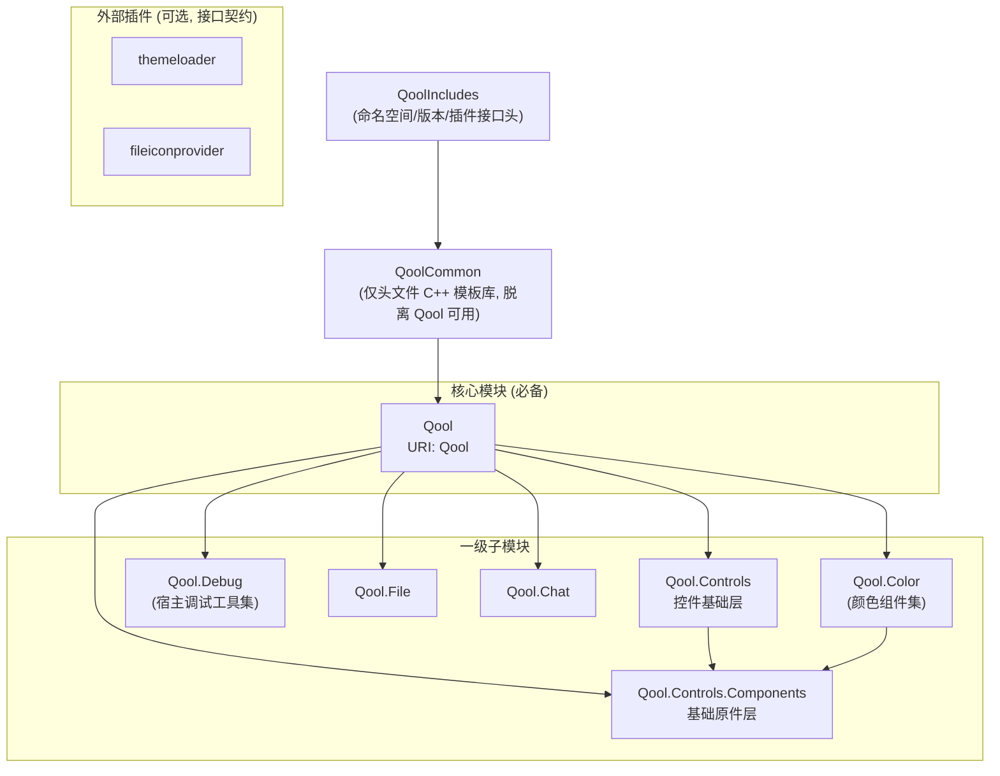

# QoolUI4

基于 Qt6/QML 的现代化 UI 组件库（第 4 代）。

## 阅读约定

本文件是根级规范，覆盖全仓库。子模块/子目录可能带有自己的 `AGENTS.md`（模块级规范，如 `QoolUI/QoolFile/AGENTS.md`），作为本文件的补充——在该模块内工作时，必须额外阅读并遵循模块级 AGENTS。

## 仓库定位

QoolUI 是 Qt6/QML UI 组件库（基础设施），供第三方应用消费。所有公开面——QML 类型、`QoolCommon` 与 `interfaces/` 头文件 API——一律假定被第三方消费，**公开即承诺**：仓库内部没有调用方不构成省略文档、跳过稳定性考量或修改/移除 API 的依据（实例：`math::cycle_in_range` 曾因"无内部调用方"被搁置，用户指出其为多种控件的基础设施后修复）。

**暴露形式**：C++ 代码几乎全部私有、**绝不动态导出**；需要暴露的 API 一律通过 QML 引擎类型系统设计（直接注册的 C++ 类型或纯 QML 组件），不提供传统 C++ DLL 调用方式。仅有的 C++ 复用面是 `QoolCommon`（INTERFACE 头文件库）与 `interfaces/`（插件接口头）。

**私有原则**：仓库内 QML 类型默认公开、原则上不设私有；特例必须显式声明（`_private/` 目录 + `QT_QML_INTERNAL_TYPE` **或「不注册 + 目录 import」机制**，见「已知陷阱 4」），源文件不得与公开 QML 混淆。注意与「暴露形式」区分：那是 C++ 暴露面的层面（几乎全私有、经 QML 暴露），本原则是仓库文件组织的层面。

**接口承诺**：`interfaces/` 插件接口为宽松承诺——接口可能演进，官方插件同步更新，第三方插件需跟随版本。

**示例程序**：QoolUIExample 兼具功能验证 prototype（持续维护，非一次性）、功能展示与宿主使用范例三重角色。

## 模块架构

**交付形态（方向）**：QoolUI 以 4 平台（msvc/mingw/darwin/linux）二进制 QML 模块包交付，每个模块是含 qmldir 的独立目录，宿主可按模块删减、仅 Qool 必备；另附带 Includes/interfaces 头文件与独立 qdoc 文档包。（具体打包方案未定，此处仅记录方向。）



### 分层

| 层 | 模块 | 定位 |
|---|---|---|
| 0 | `QoolIncludes` | 命名空间/版本头 + 插件接口（`interfaces/`），INTERFACE target |
| 1 | `QoolCommon` | 仅头文件 C++ 模板库（属性宏体系/工具/math），脱离 Qool 可用 |
| 2 | `Qool` | 核心模块：形状/样式/窗口/工具类型，QML 模块唯一必备件 |
| 3 | 一级子模块 | `Qool.Controls`——控件基础层（仅次于 Qool，类比 QtQuick.Controls）；`Qool.Chat`、`Qool.File`、`Qool.Debug`、`Qool.Color`——功能合集模块，只依赖 Qool（合集模块可依赖 `Qool.Controls`） |
| 3a | 一级子模块下层 | `Qool.Controls.Components`——基础原件层，被 `Qool.Controls` 依赖（上下级关系） |
| 4 | 二级子模块（预留） | 可依赖上级模块（如 `Qool.Controls.Extra` 可依赖 `Qool.Controls`） |
| 外 | 插件 | `themeloader`/`fileiconprovider`/色名提供器——实现接口、独立于库本体 |

### 依赖约束

- **R1 QoolUI 内部模块依赖约束**：`Qool.Controls` 是控件基础层（仅次于 Qool，类比 QtQuick 与 QtQuick.Controls），**功能合集模块（`Qool.Color`/`Qool.Chat`/`Qool.File`/`Qool.Debug` 等）可依赖 `Qool.Controls`（及 `Qool.Controls.Components`）**；同级功能合集模块互不依赖，仅上下级可依赖。对宿主而言除 Qool 外皆可选——保证目录级删减时依赖完整（对 Qt 框架模块的依赖不受此限，如 `Qool.Debug` 额外声明 `IMPORTS QtQuick.Dialogs`）
- **R2 QoolCommon 脱离 Qool 可用**：不依赖 QtQuick，作为纯 C++ 消费面
- **R3 插件外部化**：接口用纯 Qt 类型（不引用库类型），官方插件仅是参考实现，逻辑与物理上皆可选
- **R4 基础原件在下层**：`Qool.Controls` 的控件由 `Qool.Controls.Components` 的基础原件组合而成，方向不可逆

### 插件约定

- 插件优先级**统一在插件 json 的 `priority` 字段定义**（`PluginLoader` 从 json 元数据读取），接口不提供 priority 方法
- **所有官方插件 json 必须包含 `priority` 字段**，即使接口不需要——这是 v4 约定性规范，非可选
- **插件按接口分包**：同一接口的多个插件组织在同一包（目录）中，以不同 CMake target 形式共存（实例：`colornameprovider` 包内含 default/commonzh 两个插件）；例外——插件本身复杂或属非默认行为的特化功能（如某种特化实现）时可独立成包

### 依赖机制（三场景）

| 场景 | 机制 |
|---|---|
| 运行时 | QML import 语句要求模块目录存在于 import path——开发模式构建目录天然满足 |
| 交付部署 | 部署工具按 qmldir 的 import/depends 行收集依赖目录——由 CMake 的 IMPORTS/DEPENDENCIES 声明生成 |
| 编译期 AOT | qmlcachegen 需 `DEPENDENCIES TARGET` 注入 import path，缺失则类型回退运行时解析 |

**开发规范**：qmldir 由 Qt 自动生成，开发中不手写；依赖声明一律通过 `qt_add_qml_module` 的 CMake 接口配置。

## QML 模块 URI 映射

| 模块 | URI | 导入示例 |
|---|---|---|
| Qool | `Qool` | `import Qool` |
| QoolControls | `Qool.Controls` | `import Qool.Controls` |
| QoolControlsComponents | `Qool.Controls.Components` | `import Qool.Controls.Components` |
| QoolFile | `Qool.File` | `import Qool.File` |
| QoolChat | `Qool.Chat` | `import Qool.Chat` |
| QoolColor | `Qool.Color` | `import Qool.Color` |
| QoolDebug | `Qool.Debug` | `import Qool.Debug` |

## 技术栈

| 项目 | 版本/规范 |
|---|---|
| Qt | 最新正式 Release（当前 6.11.1），绝不兼容旧版 |
| C++ | C++17+（绝不兼容旧版） |
| CMake | 3.30+ |
| 第三方依赖 | 无——绝不引入（含 Qt 5 Compatibility Module（Qt5Compat）） |
| 命名空间 | `qoolui` (宏: `QOOL_NS`) |
| 版本 | 4.0.0 |

**硬约束：零第三方依赖**。除 Qt6 外绝不引入任何第三方库/模块（含 Qt 5 Compatibility Module（Qt5Compat）等 Qt 官方兼容模块）；绝不兼容 Qt5 或旧版 C++。

**版本跟进**：只跟进 Qt 最新正式 Release，不提前迁移 prerelease/testing；一旦跟进新版，绝不 backport 旧版本功能——旧版 Qt 不可用某功能不构成适配理由（例外仅限设计 bug：问题源于本库自身缺陷时须修复，而非为旧版添加适配）。`find_package` 中的最低版本是 Qt 官方兼容性提示，不随本原则变化。

**以官方文档为准，不探查 Qt 源码**：使用 Qt 时通常不查看其源代码，行为语义一律以官方文档为准；仅当怀疑 Qt 本身存在 bug（而非用法问题）时才允许探查源码验证。推断 Qt 未文档化的行为时必须标注未验证（实例：ComboBox 的 contentItem 结构对模板层 textField 识别的影响，曾以文档证据推断并标注待实测）。

**容器与算法**：充分使用 STL 容器与算法；Qt 模块内按需选用 Qt 容器（QString/QVariant 等生态必需），但算法尽量用 STL 的——仅当算法为 Qt 容器独有或 STL 不兼容时才用 Qt 算法（Qt 官方同样推荐此做法）。

## 构建命令

**规范入口是 `Scripts/qoolui_build_*.py` 工具脚本**（Windows 当前可用；macOS/Linux 为骨架，落地时完善）。脚本职责：工具链环境准备（MSVC 经 vswhere→vcvars64 注入、MinGW/Clang 经 PATH 前置 Qt 工具链）+ 命令实现（configure/build/test/run/install/deploy/release）。约定内置（preset 映射、目录命名、deploy=install+zip 归档），个性化参数输入（--qt/--jobs/--prefix/--version/透传）。QML 测试无头（offscreen）由测试注册机制保证（见「测试设施」节），非脚本约定。

```bash
# Windows/MSVC（默认 kit=msvc, type=debug——开发期默认，xDebug 输出可见）
python Scripts/qoolui_build_windows.py configure --qt C:/Qt/6.11.1
python Scripts/qoolui_build_windows.py build --jobs 8
python Scripts/qoolui_build_windows.py test          # ctest 聚合，输出落盘 build/build-<kit>-<Type>/test.log
python Scripts/qoolui_build_windows.py run           # 启动 QoolUIExample（需 --qt 或环境 QT_DIR——开发模式 Qt 运行时注入依赖它）
python Scripts/qoolui_build_windows.py install       # 输出到 build/build-<kit>-<Type>/install（含 Qt 部署脚本收集的依赖）
python Scripts/qoolui_build_windows.py deploy        # install + zip 归档
# MinGW：--kit gcc；Clang：--kit clang（Qt 安装根自动按 kit 选工具链目录）
```

> **install/deploy 部署的是 QoolUIExample 产物**（消费 QoolUI 的宿主应用）：QML 模块、Qt 运行时与翻译是 exampleapp 的运行依赖，随部署打包。QoolUI 库本身的交付包（可删减 QML 模块 + Includes 头文件 + qdoc 文档）方案未定，另立 spec，不走本通道。

**kit×type 矩阵**（CMakePresets.json）：`dev-<kit>-<type>` preset 对应用户目录 `build/build-<kit>-<Type>`（如 `dev-msvc-debug` → `build/build-msvc-Debug`）。kit = 编译方式（msvc/clang/gcc），type = debug/release（默认 debug）。编译器由脚本环境准备决定，preset 不指定——构建目录按 kit 隔离保证工具链不混。CMake 原生通道（无脚本环境准备时）亦可直接 `cmake --preset dev-msvc-debug`。

平台概念约定：**以编译方式（kit）区分命名**（对齐 Qt 安装器布局 msvc2022_64/mingw_64），不以操作系统命名；脚本结构按操作系统拆分（分支逻辑聚簇处），Unix 入口待真平台落地时完善。

## 测试设施

`QoolUITests` 为项目的测试设施（Qt Test + Qt Quick Test 双栈；术语、测试方法规范、测试策略与 CMake 组织定案见 `QoolUITests/AGENTS.md`，使用手册见 `QoolUITests/README.md`）。

**工作流规范**：修改 Qool 模块代码或测试后，运行脚本 `test` 命令（`python Scripts/qoolui_build_windows.py test`）验证——设施是全仓库改动的回归哨兵，不做例外豁免。

**QML 测试无头（offscreen）机制**：由测试注册内置保证——`add_test(... -platform offscreen)` 参数 + `QOOLUI_TEST_ARGS_tst_<模块>_qml` 变量（见 `QoolUITests/AGENTS.md` CMake 组织），脚本 `test` 仅是 ctest 聚合通道，不承担 offscreen 注入。

## 编码规范

### 文件命名
- C++ 头文件: `qool_类名.h` / `qool_类名.hpp`，源文件: `qool_类名.cpp`
- QML 文件: 大驼峰 `ComponentName.qml`；私有组件放 `_private/` 目录
- 附属类与主类同文件（如 `NumberMapperStop` + `NumberMapper`）

### 命名空间
所有 C++ 文件内容用宏包裹，**禁止手写 `namespace qoolui {`**：
```cpp
QOOL_NS_BEGIN
// ... 类定义
QOOL_NS_END
```
`QOOL_NS` 由 CMake 从 `includes/qoolns.hpp.config` 生成（值 = `qoolui`）。

### 属性宏体系（QoolCommon）

**「属性」概念界定**：本项目语境下「属性」特指 QML/Qt 属性系统成员（Q_PROPERTY + getter/setter/NOTIFY/bindable——属性宏体系生成的即是）。追踪契约与「应自动响应」的承诺边界 = 属性系统：仅属性变化产生可监听的 `xxxChanged` 信号。引擎注入的非属性机制（实例：QQuickItem 的 `transform` 列表——QML 层可见但非 Q_PROPERTY、无 NOTIFY）不在属性概念内——其变化无信号、不属追踪契约、无需声明例外或设计兜底（先例：Floater 曾为 transform 列表设计 `refresh()` 兜底——范畴错误已移除；PositionTracker `update()` 保留为批次合并的同步入口）。

**禁止手写 Q_PROPERTY + getter/setter 样板**。按场景选宏族（定义见 `QoolCommon/qoolcommon/`）：

| 宏族 | 适用 | 生成内容 |
|---|---|---|
| `QOBJECT_WRITABLE/READONLY/CONSTANT_PROPERTY` | QObject 类 | 一条宏 = 信号 + getter + setter + 成员 + Q_PROPERTY |
| `QBINDABLE_*_PROPERTY(_C_, _T_, _N_)` | Qt6 bindable 属性 | 额外生成 `bindable_xxx()` |
| `QGADGET_*_PROPERTY` | Q_GADGET 值类型（无 NOTIFY） | getter + setter + 成员 + Q_PROPERTY |

- 大文件声明/定义分离：头文件用 `_DECLARE` 后缀版（仅声明），实现在 .cpp 用同宏展开
- 宏固定命名：成员 `m_xxx`、setter 参数 `new_xxx`、getter 无前缀 `xxx()`、bindable `bindable_xxx()`
- QObject 可写 setter 自动带相等守卫 + emit；宏展开到 protected 作用域（便于子类访问）
- setter 参数类型自动选择：指针传值、其余传 `const T&`
- 例外（手写 Q_PROPERTY 而非宏）：多属性共享同一信号（如 `Message::channels`/`channel` 共用 `channelsChanged`）、无成员属性、非宏体系类（如 `Theme`）
- 批量属性变更用 `Qt::beginPropertyUpdateGroup()` / `endPropertyUpdateGroup()` 包裹，使多次 emit 原子化

**内部中间量约定**（ADR-0006 执行固化）：无 QML 消费方、无 signal 监听者的纯内部派生量用**裸 `QProperty` 成员 + 普通 getter**（无 Q_PROPERTY、无 NOTIFY signal——Q_PROPERTY 与 signal 对内部量是死重；依赖追踪走 QProperty 绑定机制，绑定求值中读其他 QProperty 的 value() 即注册依赖）。仅对外面（QML 输出）用 `QBINDABLE_*_PROPERTY`。先例：QoolBoxGadget 的 vec*/shrink*/maxShrinkDistance 等中间量。

**命名全称**：标识符与注释一律全称少缩写（`maxShrinkDistance` 而非 dStar、`insetLineConstants` 而非 linesC、`shrinkDistance` 而非 shrinkD）；数学记号（√2、θ/2 等）仅限文档公式与算法注释，不进标识符。

### 批量属性生成
同型属性清单（如 20 个 QColor）用 `QOOL_FOREACH_N` 宏 + 属性名列表批量生成（`QoolCommon/qoolcommon/macro_foreach.hpp`）：
```cpp
#define __HANDLE__(N) QOBJECT_WRITABLE_PROPERTY_DECLARE(QColor, N)
QOOL_FOREACH_10(__HANDLE__, white, silver, grey, black, ...)
#undef __HANDLE__
```
- 仅用于**同型批量属性**，单个属性直接写宏
- 可在宏族之上组合领域专属宏（如 `QOOL_DECL_POINT`/`QOOL_IMPL_POINT`：一点三属性 + bindable + 组内原子更新）
- 同一属性清单在多个类间复用保持同步（`Style` / `StyleGroupAgent` 各持一份，.cpp 用相同 FOREACH 结构生成 emit）
- 局部宏命名约定：`__HANDLE__` / `DECL` / `__SET__`，用完 `#undef`

### 方法命名分层
| 层 | 命名 | 示例 |
|---|---|---|
| QML 暴露 API（Q_INVOKABLE、属性） | camelCase | `valueAt`、`dumpInfo` |
| 内部辅助方法 | snake_case | `get_value`、`initialize_data`、`propagate_theme` |
| 槽函数 | `when_` 前缀 | `when_themeChanged` |
| QQmlListProperty 回调 / 私有辅助 | `__` 双下划线前缀 | `__appendFunction`、`__auto_insert` |

### 单例（单例组件设计模式）

全局实例统一用 `QoolCommon/qoolcommon/singleton.hpp` 三件套（`QOOL_SIMPLE_SINGLETON_DECL` + `QOOL_SIMPLE_SINGLETON_QT_IMPL`），**禁止手写静态实例**。

**形态三选一**（先按形态定位，再写代码）：
1. **纯 QML 侧工具**（无进程共享状态）→ QML 文件单例（`pragma Singleton` + `QT_QML_SINGLETON_TYPE`）——per-engine 天然安全，无需 C++（先例：Qore / PixelFont / GlobalChatRoom）
2. **C++-only 能力**（不暴露 QML）→ 普通全局单例（三件套），无 QML 注册（先例：SystemTheme / ChatRoomManager）
3. **需要 QML 暴露的进程级能力**（全局共享状态/插件集束/缓存）→ **三件套**：
   - **XxxDB**（全局单例，C++）：状态 + 逻辑 + C++ 消费面；**不暴露 QML**（无 QML_SINGLETON/QML_ELEMENT/QML_NAMED_ELEMENT）；**不标 Q_INVOKABLE**（标记只属于 QML 暴露面）；命名 `Database` → `DB`
   - **XxxHQ**（QML 单例）：每 engine 独立实例（`create()` → `new XxxHQ(engine)`，parent = engine）；**类名 = QML 注册名**（双侧同名）；转发原暴露接口（实例方法/static/属性/信号），实现调 DB；只承载 QML 面（纯 C++ 方法不转发）
   - **XxxHQModel**（普通类型，非单例，按需实例化）：模型面；优先 `QIdentityProxyModel` 挂接 DB（全套模型变更由 Qt 原生转发，DB 不进 QV4 值系统）

**硬约束**：
- **禁止进程级 C++ 单例经 `QML_SINGLETON` 暴露**——Qt 契约：共享实例只能被一个 QQmlEngine 访问，多 engine 即崩溃（4.0 系列实测 0xc0000005；QML 测试框架每文件建独立 engine）
- **接口双侧保留**：C++ 面（DB）与 QML 面（HQ）各归其位，逻辑单份在 DB
- **模型非单例化**：模型面从单例拆出为普通类型，需要处按需实例化
- **插件/数据 App 级集束**（打包/聚合）：DB 持有，HQ 消费；插件只加载一次

### 值类型（QML 可见）
内部 `struct XxxData : QSharedData` 持数据 + 门面类暴露 API：`Q_GADGET` + `QML_VALUE_TYPE(小写名)`，按可构造性选 `QML_CONSTRUCTIBLE_VALUE`（Q_INVOKABLE 构造函数）或 `QML_STRUCTURED_VALUE`。链式 API 返回 `Type&`（如 `Message::attach()`）。

### QML 逻辑对象基类
QML 列表/逻辑容器继承 `SmartObject`（`Qool/utils/qool_smartobj.h`：QQmlParserStatus + DefaultProperty(smartItems)）。需要列表属性时：`Q_CLASSINFO("DefaultProperty", ...)` + `QML_LIST_PROPERTY_ASSIGN_BEHAVIOR_REPLACE_IF_NOT_DEFAULT` + `QQmlListProperty` + `__` 静态回调。

### 模型线程规范
QAbstractItemModel 子类**遵循 Qt 官方线程规范：不加锁**（QAbstractItemModel 非线程安全，官方约定跨线程访问一律经 Queued 信号/连接转发，由接收线程独占访问）。模型内出现锁是审查红旗——要么无跨线程调用方（锁是死代码，应删除），要么调用方违反线程契约（应改为转发）。单线程契约写入模型类注释（实例：FileInfoListModel 曾用 QRecursiveMutex 全包裹，无任何跨线程调用方，已删除并注明契约）。

### 调试输出
统一用 `QoolCommon/qoolcommon/debug.hpp` 宏（带类名 token 与颜色），**禁止裸 qDebug()**：
- `xDebugQ` / `xInfoQ` / `xWarningQ` / `xCriticalQ` / `xFatalQ`（带 `[类名]` token）
- 颜色 token `xDBGYellow` 等；容器输出 `xDBGVariant` / `xDBGList` / `xDBGMap` / `xDBGQPropertyList`

### 槽/信号标注
**禁止 `private slots:` / `public signals:` 区语法**，一律以 `Q_SLOT` / `Q_SIGNAL` 宏直接标注成员函数（如 `Q_SLOT void when_xxxChanged()`）。目的：保证与宏体系一致性——`Q_SLOT`/`Q_SIGNAL` 是 moc 认识的宏，宏展开内可安全使用；而 `private slots:` 区语法入宏后 moc 不收集（Qt 6.11 实证）。

### 信号命名
信号是**瞬时状态变化的宣告**（过去式语义 `somethingHappened`——事件已发生），
不是"更新动作"的命名：
- **属性变更（无参）**：`xxxChanged`（宏生成——属性宏体系固定
  `Q_SIGNAL void _N_##Changed()` + setter 相等守卫）。**Changed 语义 =
  值实际变化才发出**（普通宏 setter 显式守卫；bindable 宏由
  `QObjectBindableProperty::operator=` 内置相等守卫保证——setter 不写
  守卫是刻意的，勿补勿删；NOTIFY 语义）
- **属性变更（带参）**：`xxxUpdated`（如 `valueUpdated(newValue, oldValue)`）
  ——**与 `xxxChanged` 同为属性变化信号，触发条件相同（值实际变化才发），
  区别仅为参数**：Updated 携带新旧值数据（新值在前：Qt 惯例 + 单参
  handler 自动降级为新值、旧值丢弃）；Changed 无参（值从属性读）。携带
  **定位/标识参数**（非新旧值）的变化通知不受此条约束（实例：
  `Style.valueChanged(group, key)`、`ColorBank.colorChanged(index)`——参数
  标识"哪个属性/哪个槽位"，维持 Changed 命名，既有 API 不追溯）
- **动作完成宣告**（非属性变化语义）：`xxxUpdated`——宣告"更新/重新设定
  动作完成"，**不承诺值变化**（值变化不是守卫条件——允许值未变时发出），
  但**非每次动作必发**——是否发出由动作语义决定，无宣告意义的动作不
  重发。典型用例：currentRowUpdated（currentIndex 被重新设定但行可能未变，
  值相同也须通知——"重新设定"动作本身有宣告意义）
- **瞬时事件**（非属性信号）：过去式短语，如 `beeperSignedIn`、`messageRecieved`
- **动作/请求**：`wannaXxx`（如 `wannaSignIn`、`wannaMove`）——意图/请求信号，
  与执行槽成对构成实时接口：`wannaChangeX`（请求）→ `changeX`（执行槽）→
  `xChanged`（结果通知）
- **变化汇聚**：多个变更信号汇聚到一个槽 → `when_` 前缀（仓库书写惯例，
  snake_case）：`[xChanged, yChanged]` → `when_positionChanged`（实例：
  `when_themeChanged`、`when_parentValueChanged`）
- 注意 `messageRecieved` 的拼写是**既有 API，勿修正**（多处一致）

### 注释与文档
代码注释与 QDoc 用法文档只描述当前行为与设计意图，**不体现修改历史**（如"同步修改""不在兼容范围""迁移/改名"类元语境）——修改历史归 CHANGELOG.md。

### QML 组件规范
- **多层插拔（v4 设计原则）**：控件/视图功能面按层分解——View / Delegate / Display——每层提供与相邻层配套的默认实现，但每一层都可独立替换，替换不破坏相邻层配套：
  - View 与 Model 配套（特化视图，如 `FileInfoListView` 配 `FileInfoListModel`），用户可自行实现 View
  - Delegate 与 View 配套，用户可用默认 View + 自定义 Delegate
  - Display 与 Delegate 配套（`Component` 属性暴露，如 `fileInfoDisplay`，默认 `BasicFileInfoDisplay`），用户可用默认 Delegate 沿用行为、只替换样式组件
  - 所有可显示组件最终兼容 Style 系统（`root.Style.*`）
  - 实例：Qool.File 的 FileInfoListView / FileInfoDelegate / BasicFileInfoDisplay 三层配套
- import 惯例: `import QtQuick`（无版本号）、`import QtQuick.Templates as T`、`import Qool`、`import "_private"`；必要时 `pragma ComponentBehavior: Bound`
- 根组件选择: 交互控件用 `T.*` 模板基类（T.Control / T.AbstractButton / T.ComboBox ...）；纯装饰用 Item/Text；调试叠加层用 Floater；逻辑容器用 SmartObject
- 统一 `id: root`；固定内部命名: 背景 `bgbox`、padding `spacer`（SpaceHelper）、逻辑对象 `pCtrl`、页面主列 `cc`
- 样式一律取自 `root.Style.*`（附加属性）；背景封装为 `QoolBoxSettings` 对象（属性名 `backgroundSettings`，就地覆写 `borderWidth`/`fillColor`/`cutSize*`）
- 动画用 `Basic*Behavior on X`（BasicNumber/Color/TextBehavior）+ `enabled: root.Style.animationEnabled` 门控；`animationEnabled` 控制的不只是动画，还包括一切高开销的样式效果（Shader 特效、粒子、复杂效果样式）——语义是「高性能模式 vs 完整效果」切换，而非单纯的动画开关
- 交互反馈: `ControlPressedCover` / `ControlHighlightCover` / `ControlLockedCover` 三件套
- delegate 用 `required property` 接收 model/index；对外状态用 `readonly property` 代理内部 pCtrl
- 文案一律 `qsTr()`；页面派生 `BasicPage`（required title/note），`SectionBar` 分段，`QoolTip` 内嵌
- **排版文字≠文本**：装饰性排版文字（像素字体标签类，如通道标签 HUE/SATURATION、L/S 字母）是通过 Text 实现的画面元素，其内容、字号、字体、排版配套设计——复刻原样、**不加 qsTr()、不翻译**（是「文案一律 qsTr」的明确例外）。
- **公开组件默认状态必须自洽**：组件的初始化定义即默认行为，独立使用（无宿主上下文、不设额外属性）时默认状态必须成立——"独立使用场景成立"是设计义务，不是可选项。审查/修复时优先检查默认值、默认结构、默认外观是否自洽（实例：IndexIndicator 的 rows/columns 自引用环、ComboBox editable 场景的 textField 引用）
- **Debug 工具边界暴露原则**：Qool.Debug 是宿主调试工具集，边界条件（除零、最小尺寸、越界参数）**有意暴露使用问题**——可见的异常行为是功能（误配置时立即发现），静默错误/崩溃才算缺陷。审查 Debug 模块时，边界暴露不按 bug 处理，只有掩盖问题（如静默吞掉）才需要修
- 块尾注释标记闭合: `}//contentItem`

### QML 模块注册 (CMake)
```cmake
qt_add_qml_module(ModuleName
    URI Qool.Module      # QML 导入 URI
    VERSION ${QOOLUI_VERSION_QML}
    NAMESPACE ${QOOL_NS} # 固定为 qoolui
    IMPORTS Qool         # 声明模块依赖：写入 qmldir import 行（部署收集依据）；编译期静态解析依赖
    QML_FILES ...
    SOURCES ...
)
```
- QML 单例文件用 CMake 属性注册（而非 QML_SINGLETON 注解）: `set_source_files_properties(Xxx.qml PROPERTIES QT_QML_SINGLETON_TYPE TRUE)`——这是 .qml 文件的通道（形态一）；C++ 侧需要 QML 暴露的进程级能力走三件套模式（见「单例」节），**禁止进程级 C++ 单例经 QML_SINGLETON 暴露**，两者不混用
- 文件按目录分组列出（如 `apps/xxx.h`），include 目录对应声明
- 依赖机制见「模块架构 → 依赖机制（三场景）」；qmldir 不手写

## 文档规范（QDoc）

- QDoc 注释仅从 `.cpp`/`.qdoc` 文件提取，**头文件不被 QDoc 扫描**——发布头（`qoolns.hpp`、`interfaces/*.h`）禁止 QDoc 注释，只允许普通注释（`//`、`/* */`）
- C++ QML 类型：类文档（`\qmltype` + `\nativetype`）写在对应 `.cpp`；宏生成属性无代码位置可挂 → 用独立 `\qmlproperty` 注释块，集中到 `Qool/qool.qdoc`
- `.qml` 类型：`\qmltype` 注释块紧贴 `.qml` 文件内类型上方
- 模块总览（`\qmlmodule`）与组织性文章（`\page`）必须独立 `.qdoc` 文件，放模块根目录（如 `Qool/qool.qdoc`）
- `.qdoc` 是代码的 sidecar：对应某个代码文件的 `.qdoc` 放在该文件旁边、尽量同名（如 `qool_style.cpp` → `qool_style.qdoc`）
- **QoolCommon（仅头文件库）的文档归属自身**：`\namespace`/`\fn` 等 C++ API 文档写 QoolCommon 内的独立 `.qdoc`（如 `qoolcommon/math/utils.qdoc` 承载 math 命名空间），用 `\inmodule QoolCommon` 而非 `\inqmlmodule Qool`——QoolCommon 会被第三方独立消费，文档不得挂靠 Qool 模块
- 一律不设 `doc/` 目录
- 刻意设计（非 bug 行为、设计意图）必须用 QDoc 说明，防止后续审查误判（先例：fillItem 替代 CutCornerImage、关闭按钮配件哲学、control 回退值机制）
- **QML 类型文档内容规范（参照 Qt 官方 QML 类型页格式）**：
  - 文档叙述**用法**，不是开发笔记——面向使用者写"怎么用、行为是什么、宿主该做什么"；实现机制与设计原因归代码注释，不进 QDoc（实例：ComboBox 的 Loader 结构/模板识别失败等机制只在注释说明，QDoc 只讲 editable 用法与处理路径）
  - 结构对齐官方类型页：类型概述（定位 + 继承关系）→ 属性文档 → 信号文档 → 方法文档 → 主题章节（关键行为/使用场景）
  - 逐属性说明（类型、默认值、语义、注意点）；同义分组属性（如 contentPadding 系列）共用一段
  - 继承 Qt 官方模板/控件类型的组件，必须声明**接口兼容性**：官方 API 全部可用、宿主可参照官方文档；QDoc 只文档化 Qool 新增与差异部分
  - 与 Qt 官方行为不同的**契约必须明示**（如 editable 提交后 currentIndex/currentText 不自动更新、宿主在 onAccepted 中自行 find 处理），防止宿主误用与后续审查误判
- **修复 bug 时必须评估专项注释**：每处修复补"为什么这样改"的代码注释（含被修复缺陷的机制一句话），并评估被误解的 API 是否需补文档说明——修复与专项注释不可分离（先例：锁的取舍——Beeper 加锁/MessageLogger、FileInfoListModel 不加锁均注明原因；注册时机、move 差一、枚举引用修复均带机制注释）

## 变更记录

- 每次修改更新 `CHANGELOG.md`（已加入 `QOOL_GENERAL` 目标）
- 版本号不随常规修改迭代，维持 `4.0.0` 直至正式发布时递增

## 已知陷阱

### 1. QML 模块依赖声明
运行时解析靠模块目录存在于 import path（开发模式构建目录天然满足）；交付部署时部署工具按 qmldir 的 import/depends 行收集依赖目录（该行由 CMake 的 `IMPORTS`/`DEPENDENCIES` 生成）；编译期 AOT（qmlcachegen）需要 `DEPENDENCIES TARGET` 注入 import path，缺失则类型退化为运行时解析。qmldir 由 Qt 自动生成，开发中不手写，依赖声明一律通过 `qt_add_qml_module` 的 CMake 接口配置。

### 2. 插件加载路径
`qoolplugins/` 目录必须与可执行文件同级目录:
```
build/build-<kit>-<Type>/           # 如 build/build-msvc-Debug/
├── QoolUIExample.exe
├── qml/
└── qoolplugins/  ← 必须在此位置
```

### 3. CMake 缓存问题
修改 QML 模块结构后需清理缓存:
```bash
rm -rf build/build-<kit>-<Type>/CMakeCache.txt build/build-<kit>-<Type>/CMakeFiles
```

### 4. 私有 QML 文件
两种机制（选一，效果等同：宿主不可见）：

- **internal 标记**：`_private/*.qml` 设 `QT_QML_INTERNAL_TYPE TRUE`。**限制（Qt 6.11 运行时实证）**：internal 类型不能被其他 internal 文件引用（同目录隐式 import 与模块 URI import 均失效，公开文件引用 internal 正常）——仅适用于私有件之间无互引的模块。
- **不注册 + 目录 import**（Color 模块采用）：`_private` 文件**不进 `QML_FILES`**（qmldir 无条目，宿主 import 模块看不到），经 `qt_add_resources` 打进 qrc（`PREFIX "/qt/qml/<URI>"`，BASE 模块源码目录），模块内文件 `import "_private"`（相对目录 import）使用；私有件之间互引走同目录隐式解析。私有件无 qmlcachegen AOT 缓存（运行时源码解析，性能可接受）。

### 5. containmentMask 不约束子 MouseArea 的 hover（Qt 6.11 实证）

Qt 的 QHoverEvent 分发（`QQuickDeliveryAgent::deliverHoverEventRecursive`）对每个 item **独立调用其自身 `contains`**，不检查祖先 Item 的 containmentMask——组件 root 上的掩码只约束 QPointerEvent（点击/按下）路径；宿主 MouseArea 的 hover 走自身 contains（无掩码 = 矩形判定，形状外误 hover）。**带掩码组件（Crystal/HalfCrystal 等）+ 宿主 MouseArea 需要精确 hover 时，须把掩码显式挂到 MouseArea**（anchors.fill 时本地坐标即组件本地，坐标基准一致）：

```qml
HalfCrystal {
    id: crystal
    MouseArea {
        anchors.fill: parent
        hoverEnabled: true
        containmentMask: crystal.containmentMask
    }
}
```

掩码对象非 QQuickItem（Gadget 为 QObject）可被多 Item 引用，无注册冲突。契约说明见 HalfCrystal/Crystal QDoc「命中掩码」；回归测试 `tst_qool_hover_e2e`（真实鼠标路径，offscreen）。

## 关键文件路径

| 用途 | 路径 |
|---|---|
| 项目配置 | [qool_qml_project_setup.cmake](file:///d:/workspace/QoolUI4/qool_qml_project_setup.cmake) |
| 命名空间定义 | [includes/qoolns.hpp.config](file:///d:/workspace/QoolUI4/QoolUI/includes/qoolns.hpp.config) |
| 插件接口 | [interfaces/](file:///d:/workspace/QoolUI4/QoolUI/interfaces/) |
| 变更记录 | [CHANGELOG.md](file:///d:/workspace/QoolUI4/CHANGELOG.md) |

## Agent skills

### Issue tracker

Issue 与 spec 存于本仓库 `.scratch/<feature-slug>/` 下的 markdown 文件。见 `docs/agents/issue-tracker.md`。

### Triage labels

五个规范角色使用默认标签字符串：`needs-triage`、`needs-info`、`ready-for-agent`、`ready-for-human`、`wontfix`。见 `docs/agents/triage-labels.md`。

### Domain docs

单 context 布局：仓库根部一个 `CONTEXT.md` + `docs/adr/`。见 `docs/agents/domain.md`。
