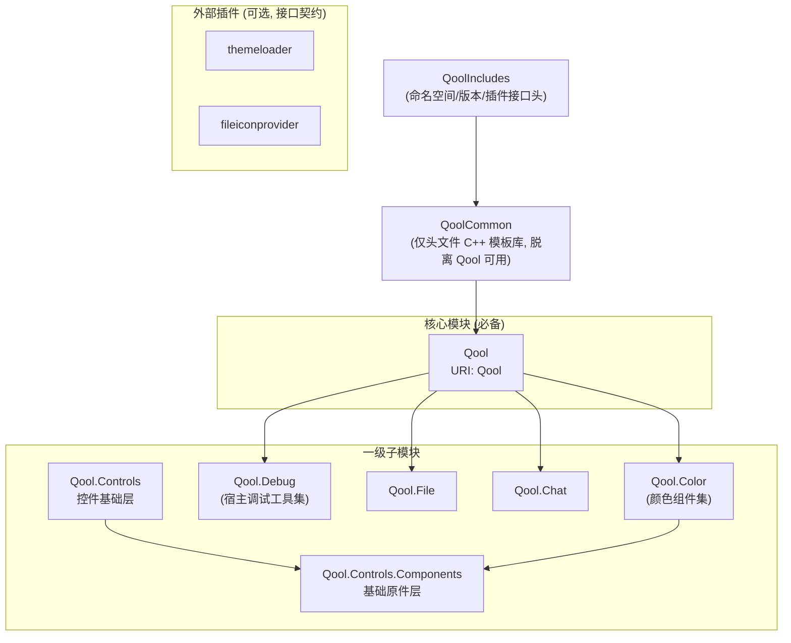

# QoolUI4

基于 Qt6/QML 的现代化 UI 组件库（第 4 代）。

## 文档地图

- 根 `AGENTS.md`（本文件）：全仓库规范。
- 子/模块 AGENTS（`QoolUITests/AGENTS.md`、`QoolUI/QoolFile/AGENTS.md`、`QoolUI/QoolDebug/AGENTS.md`、`QoolUIExample/AGENTS.md`）：各自板块的补充规范。
- `docs/agents/`：工作流文档（issue tracker、triage 标签、领域文档）。
- `docs/reference/` 与 `docs/articles/`：接口文档与独立文章（Markdown）。
- `docs/adr/` 与 `CONTEXT.md`：决策记录与领域术语。
- `WATCHDOG.md`：AGENTS 的极简提醒。

## 权威标记

本文件规则分三级：**MUST**（硬约束，违反即缺陷）、**SHOULD**（推荐惯例，偏离需说明理由）、**MAY**（可选）。「应当」对应 SHOULD；未标等级的陈述为事实描述或设计哲学，非行为约束。

## 定位

QoolUI 是 Qt6/QML UI 组件库（第 4 代），供多重用户消费（生态开发者、库消费者）。多重用户意味着全仓库标准不止于「能跑」——小到命名、大到架构与文档都要有前瞻性，为各层用途负责。

**暴露形式**（MUST）：C++ 代码几乎全部私有、**绝不动态导出**；需要暴露的 API 一律通过 QML 引擎类型系统设计（直接注册的 C++ 类型或纯 QML 组件），不提供传统 C++ DLL 调用方式。仅有的 C++ 复用面是 `QoolCommon`（INTERFACE 头文件库）与 `interfaces/`（插件接口头）。

**私有原则**（MUST）：仓库内 QML 类型默认公开、原则上不设私有；特例走 `_private/` 目录，源文件不得与公开 QML 混淆。注意与「暴露形式」区分：那是 C++ 暴露面的层面（几乎全私有、经 QML 暴露），本原则是仓库文件组织的层面。

**接口承诺**：`interfaces/` 为插件契约——接口可能演进，改 `interfaces/` 须同步更新自带插件（同一变更），第三方插件 break 是预期代价。

**示例程序**：QoolUIExample 兼具功能验证 prototype（持续维护，非一次性）、功能展示与宿主使用范例三重角色。

## 模块架构



### 分层

| 层 | 模块 | 定位 |
|---|---|---|
| 0 | `QoolIncludes` | 命名空间/版本头 + 插件接口（`interfaces/`），INTERFACE target |
| 1 | `QoolCommon` | 仅头文件 C++ 模板库（属性宏体系/工具/math），脱离 Qool 可用 |
| 2 | `Qool` | 核心模块：形状/样式/窗口/工具类型，QML 模块唯一必备件 |
| 3 | 一级子模块 | `Qool.Controls`——控件基础层（仅次于 Qool，类比 QtQuick.Controls）；`Qool.Chat`、`Qool.File`、`Qool.Debug`、`Qool.Color`——功能合集模块，只依赖 Qool（合集模块可依赖 `Qool.Controls`） |
| 3a | 一级子模块下层 | `Qool.Controls.Components`——基础原件层，被 `Qool.Controls` 依赖（上下级关系） |
| 4 | 二级子模块（预留） | 可依赖上级模块（如 `Qool.Controls.Extra` 可依赖 `Qool.Controls`） |
| 外 | 插件 | `themeloader`/`fileiconprovider`/色名提供器——实现接口、独立于库本体 |

### 依赖约束

- **R1 QoolUI 内部模块依赖约束**：`Qool.Controls` 是控件基础层（仅次于 Qool，类比 QtQuick 与 QtQuick.Controls），**功能合集模块（`Qool.Color`/`Qool.Chat`/`Qool.File`/`Qool.Debug` 等）可依赖 `Qool.Controls`（及 `Qool.Controls.Components`）**；同级功能合集模块互不依赖，仅上下级可依赖。对宿主而言除 Qool 外皆可选——保证目录级删减时依赖完整（对 Qt 框架模块的依赖不受此限，如 `Qool.Debug` 额外声明 `IMPORTS QtQuick.Dialogs`）
- **R2 QoolCommon 与 Qool 可独立消费**：QoolCommon 不依赖 QtQuick、脱离 Qool 可用；调整须兼顾项目内调用与潜在外部用户
- **R3 插件外部化**：接口用纯 Qt 类型（不引用库类型），自带插件仅是参考实现，逻辑与物理上皆可选
- **R4 基础原件在下层**：`Qool.Controls` 的控件由 `Qool.Controls.Components` 的基础原件组合而成，方向不可逆

### 插件约定

- 插件优先级**统一在插件 json 的 `priority` 字段定义**（`PluginLoader` 从 json 元数据读取），接口不提供 priority 方法
- **所有自带插件 json 必须包含 `priority` 字段**，即使接口不需要——这是 v4 约定性规范，非可选
- **插件按接口分包**：同一接口的多个插件组织在同一包（目录）中，以不同 CMake target 形式共存（实例：`colornameprovider` 包内含 default/commonzh 两个插件）；例外——插件本身复杂或属非默认行为的特化功能时可独立成包

### 依赖机制

qmldir 由 Qt 自动生成，开发中不手写；依赖声明一律通过 `qt_add_qml_module` 的 `IMPORTS`/`DEPENDENCIES` 配置。

## QML 模块 URI 映射

| 模块 | URI | 导入示例 |
|---|---|---|
| Qool | `Qool` | `import Qool` |
| QoolControls | `Qool.Controls` | `import Qool.Controls` |
| QoolControlsComponents | `Qool.Controls.Components` | `import Qool.Controls.Components` |
| QoolFile | `Qool.File` | `import Qool.File` |
| QoolChat | `Qool.Chat` | `import Qool.Chat` |
| QoolColor | `Qool.Color` | `import Qool.Color` |
| QoolDebug | `Qool.Debug` | `import Qool.Debug` |

## 技术栈约束

| 项目 | 版本/规范 |
|---|---|
| Qt | 最新正式 Release |
| C++ | C++20 |
| CMake | 3.30+ |
| 第三方依赖 | 无——绝不引入（含 Qt 5 Compatibility Module（Qt5Compat）） |
| 命名空间 | `qoolui` (宏: `QOOL_NS`) |
| 版本 | 4.0.0 |

**硬约束：零第三方依赖**。除 Qt6 外绝不引入任何第三方库/模块（含 Qt 5 Compatibility Module（Qt5Compat）等 Qt 官方兼容模块）。

**版本跟进**：只跟进 Qt 最新正式 Release，不提前迁移 prerelease/testing；绝不为了兼容旧版而妥协，充分使用新特性。

**容器与算法**：充分使用 STL 容器与算法；Qt 模块内按需选用 Qt 容器（QString/QVariant 等生态必需），但算法尽量用 STL 的——仅当算法为 Qt 容器独有或 STL 不兼容时才用 Qt 算法。

**以官方文档为准**：使用 Qt 时以官方文档为真实依据，不额外探查 Qt 源码；文档不清不过分纠结；不为 Qt 本身做验证，专注本项目层面。

## 构建命令

**规范入口是 `Scripts/qoolui_build_*.py` 工具脚本**（Windows/Linux 当前可用；macOS 为骨架，落地时完善）。脚本职责：工具链环境准备（MSVC 经 vswhere→vcvars64 注入、Windows MinGW/Clang 经 PATH 前置 Qt 工具链、Linux GCC/Clang 经 CC/CXX 注入）+ 命令实现（configure/build/test/run/install/deploy/release）。约定内置（preset 映射、目录命名、deploy=install+zip 归档），个性化参数输入（--qt/--jobs/--prefix/--version/透传）。

```bash
# Windows/MSVC（默认 kit=msvc, type=debug——开发期默认，xDebug 输出可见）
python Scripts/qoolui_build_windows.py configure --qt <Qt安装根>
python Scripts/qoolui_build_windows.py build --jobs 8
python Scripts/qoolui_build_windows.py test          # ctest 聚合，输出落盘 build/build-<kit>-<Type>/test.log
python Scripts/qoolui_build_windows.py run           # 启动 QoolUIExample（需 --qt 或环境 QT_DIR——开发模式 Qt 运行时注入依赖它）
python Scripts/qoolui_build_windows.py install       # 输出到 build/build-<kit>-<Type>/install（含 Qt 部署脚本收集的依赖）
python Scripts/qoolui_build_windows.py deploy        # install + zip 归档
# MinGW：--kit gcc；Clang：--kit clang（Qt 安装根自动按 kit 选工具链目录）

# Linux/GCC（默认 kit=gcc, type=debug；--qt 可省略，自动探测 qmake6 或 /usr）
python Scripts/qoolui_build_linux.py configure --qt /usr
python Scripts/qoolui_build_linux.py build --jobs 8
python Scripts/qoolui_build_linux.py test           # ctest 聚合，输出落盘 build/build-<kit>-<Type>/test.log
QT_QPA_PLATFORM=offscreen python Scripts/qoolui_build_linux.py run
python Scripts/qoolui_build_linux.py install        # 输出到 build/build-<kit>-<Type>/install
python Scripts/qoolui_build_linux.py deploy         # install + zip 归档
# Clang：--kit clang（构建目录按 kit 隔离为 build/build-clang-<Type>）
```

**kit×type 矩阵**（CMakePresets.json）：`dev-<kit>-<type>` preset 对应用户目录 `build/build-<kit>-<Type>`（如 `dev-msvc-debug` → `build/build-msvc-Debug`）。kit = 编译方式（msvc/clang/gcc），type = debug/release（默认 debug）。编译器由脚本环境准备决定，preset 不指定——构建目录按 kit 隔离保证工具链不混。CMake 原生通道（无脚本环境准备时）亦可直接 `cmake --preset dev-msvc-debug`。

平台概念约定：**以编译方式（kit）区分命名**（对齐 Qt 安装器布局 msvc2022_64/mingw_64，Linux 为 gcc_64），不以操作系统命名；脚本结构按操作系统拆分（分支逻辑聚簇处），macOS 入口待真平台落地时完善。

## 编码规范（C++）

### 命名风格

**「属性」概念界定**：本项目语境下「属性」特指 Qt 元对象系统 property 机制（Q_PROPERTY 注册的成员），非自然语言泛指。

**文件命名**：C++ 头文件 `qool_类名.h` / `qool_类名.hpp`，源文件 `qool_类名.cpp`；私有组件放 `_private/` 目录；附属类与主类同文件（如 `NumberMapperStop` + `NumberMapper`）。

**命名空间**（MUST）：所有 C++ 文件内容用 `QOOL_NS_BEGIN`/`QOOL_NS_END` 宏包裹，**禁止手写 `namespace qoolui {`**。`QOOL_NS` 由 CMake 从 `includes/qoolns.hpp.config` 生成（C++ 宏与 CMake `${QOOL_NS}` 变量同源），命名空间值统一承载、不硬编码。

**方法命名分层**：

| 层 | 命名 | 示例 |
|---|---|---|
| QML 暴露 API（Q_INVOKABLE、属性） | camelCase | `valueAt`、`dumpInfo` |
| 内部辅助方法 | snake_case | `get_value`、`initialize_data`、`propagate_theme` |
| 槽函数 | `when` 命名（响应信号） | `whenColorChanged` |
| QQmlListProperty 回调 / 私有辅助 | `__` 双下划线前缀 | `__appendFunction`、`__auto_insert` |

**成员变量与 setter 参数**：成员 `m_` 前缀、setter 参数 `new_` 前缀（属性宏体系固定命名，宏详情见 QoolCommon 源码）。

**命名全称**：标识符与注释一律全称少缩写（`maxShrinkDistance` 而非 dStar、`shrinkDistance` 而非 shrinkD）；数学记号（√2、θ/2 等）仅限文档公式与算法注释，不进标识符。

### 属性

属性应当优先用 QoolCommon 属性宏定义，以统一风格并集中维护；无宏覆盖的非标准场景手工实现。

### SmartObject

Qool 自定义强化版 `QtObject`（**非 `QObject`**，兼容 QtObject），等价于非 Item 容器；列表/逻辑容器可选继承，非必须。

### 槽/信号标注

**禁止 `private slots:` / `public signals:` 区语法**，一律以 `Q_SLOT` / `Q_SIGNAL` 宏直接标注成员函数（如 `Q_SLOT void when_xxxChanged()`）。区语法入宏后 moc 不收集（仓库属性宏体系导致的特有约束）。

### 信号命名（项目惯例 SHOULD）

信号是瞬时状态变化的宣告（过去式语义 `somethingHappened`——事件已发生），不是"更新动作"的命名：

- **属性变化（默认）**：无参 `xxxChanged()`，不携带值，对齐 Qt 惯例——**仅值实际变化时触发**
- **属性变化（需承载值）**：另设 `xxxUpdated(newValue, oldValue)`，必带两个值、新值在前（Qt 惯例；单参 handler 自动降级为新值、旧值丢弃）
- **通用信号**：动词过去式（`xxxUpdated`、`xxxEdited`、`xxxRequested`…）——其中动作完成类（如 `currentRowUpdated`）宣告动作完成、不承诺值变化，由动作语义决定是否发出
- **意图请求**：`wannaXxx`（如 `wannaSignIn`、`wannaMove`）——意图/请求信号，与执行槽成对构成实时接口
- **响应信号的槽**：`when` 命名（如 `whenColorChanged`）
- **变化汇聚**：多个变更信号汇聚到一个槽 → `when` 命名：`[xChanged, yChanged]` → `whenPositionChanged`

组合链示例（环节可增减，示例非规定）：`wannaChangeName → whenNameChangeRequested → nameChanged → whenNameChanged`。

## QML 组件规范

- **多层插拔（v4 设计哲学）**：各种视觉组件、对其子元素应提供插拔能力；若组件或子元素同时包含「特化功能」和「外观」两方面，应将这两方面的插拔能力尽可能解耦。实例：
  - QoolFile：View 是 Model 的特化视图、Delegate 带配套特化行为，为它专门设可插拔的 Display（`fileInfoDisplay`），让「行为」与「外观」分别可插拔；
  - Slider：整体是特化风格（无特化行为），`background`/`handle` 沿用 Qt 原本的可插拔行为——外观（两元素分别）可插拔；
  - QoolBGBox：`title` 属性是特化行为、`titleItem` 是外观组件，二者分别可插拔、默认一致，用户可用任意 Item 替换 `titleItem` 甚至不响应 `title`，完全解耦。
- 统一 `id: root`
- **Style 双重身份**：QoolUI 提供强大样式系统，`Qool.Style` 是其实现。Style 在 Qool 内是重要组件（谨慎维护）；在其它模块（Controls 等）是样式扩散机制（类比 QoolCommon 之于 C++，QML 侧应充分使用）
- **animationEnabled 含义**：完整外观效果的取舍开关——「高性能模式 vs 完整效果」切换，非单纯的动画开关；控制的不只是动画，还包括一切高开销的样式效果（Shader 特效、粒子、复杂效果样式）
- **animationEnabled 声明序（MUST）**：控件声明 `animationEnabled` 属性时必须置于自定义属性第一位（统一声明序——动画门控是控件常驻接口，固定首位便于宿主识别）
- `pragma ComponentBehavior: Bound`：按需编写（Bound = 组件内 id 绑定到实例）

## 注释与文档规范（Markdown）

文档统一 Markdown（`docs/` 下），不使用 QDoc。文档是完整论述、非接口字典——对外呈现，需可读准确，不能乱写。

**接口文档（reference）**：`docs/reference/<模块>/<组件>.md`，**MUST 5 节**（概述/属性/信号/方法/使用示例，示例仅可复用组件）；`docs/reference/<模块>/index.md` 模块总览；英文 + Qt 风格（惯例表达避免歧义）。实现完备（测试通过 + 用户无进一步代码调整要求）后更新一次。

**独立文章（article）**：`docs/articles/`，分设计哲学论述/开发原理推导/开发过程演变三类，非接口文档格式；语言不限（中英文均可），确保准确性 + 可读性。agent 判断有洞察时向用户提示新发现，不得自行增改（专门总结后由用户决定）。

**代码注释**：简体中文、点状就地、跟随代码；应当注释设计意图/非显然行为/陷阱约束/复杂算法理由；不注释自解释代码。

**分工原则**：注释点状就地（读代码必须知道的）；文档成篇完整（完整理解需要的）。

## 测试

`QoolUITests` 为项目的测试设施（Qt Test + Qt Quick Test 双栈；术语、测试方法规范、测试策略与 CMake 组织定案见 `QoolUITests/AGENTS.md`，使用手册见 `QoolUITests/README.md`）。

## 验证策略

验证强度随改动类型分级；**全量编译+测试不是默认动作**，是「完整落地一套修改」的收尾回归哨兵。验证不止测试——含编译、运行时复现、用户人工运行验证。

### 分级验证模型

| 改动类型 | 验证通道 | 全量 |
|---|---|---|
| 注释 / 文档 / 无逻辑重命名 | 代码走读 | 否 |
| 纯 QML 内容 / 行为改动 | 用户运行验证（交付验证协议）或针对性单测试 | 否 |
| 构建结构改动（CMake / 注册 / 资源） | 编译（build）——注册面改动编译是真验证 | build 即可 |
| 完整落地一套修改 | build + 全量 ctest | 是 |

### 行为规则

验证决策遵循「提前判断、中途不纠结、具体情况问用户」：

- **判断前置**：改动动手前先按任务性质、用户要求、改动影响面判断验证深度与通道，不把判断拖到中途或事后。
- **问用户是默认而非兜底**：凡验证深度/通道存在多个合理分支、且你无法低成本确定时，**默认把选择摆给用户**（给出你的倾向与理由），不无条件选「不问用户」的分支闷头走——「判断不清才问」是被动兜底，「动手前主动摆选择」才是正路。
- **commit 前不做全量**：只做思维检查「本次改动是否都有验证」；有未验证项 → 提醒用户「是否待完整验证后 commit」，由用户决定。
- **优先用户运行验证**：改动适合人工目视/操作判断时，交付**验证协议**（运行后验证什么、如何观察、如何反馈给我），不写临时探针。临时探针仅在测试本身是任务一部分（回归资产）时写。
- 验证通道的具体操作与摩擦规避见 `QoolUITests/AGENTS.md`（输出验证通道分级、测试工作流）。

## 工作流约定

- issue tracker：`docs/agents/issue-tracker.md`（本地 `.scratch/` Markdown 票）
- triage 标签：`docs/agents/triage-labels.md`
- 领域文档：`docs/agents/domain.md`（CONTEXT.md + docs/adr 的消费方式）
- **ADR 时效性（MUST）**：ADR 是决策锚定、优先级最高——任何讨论/修订/决策之后、动手实施之前，先检查相关 ADR 是否需要同步调整，保证 ADR 与当前决策一致、不滞后（索引见 `docs/adr/README.md`）

## 已知陷阱

**不能假定运行时仅有一个 QML 引擎存在**：`QML_SINGLETON` 暴露的是引擎内单例；禁止以「直接传递 C++ 进程级单例实例」方式实现（多 engine 场景会崩溃）。

## 变更记录

每次修改更新 `CHANGELOG.md`（已加入 `QOOL_GENERAL` 目标）。
