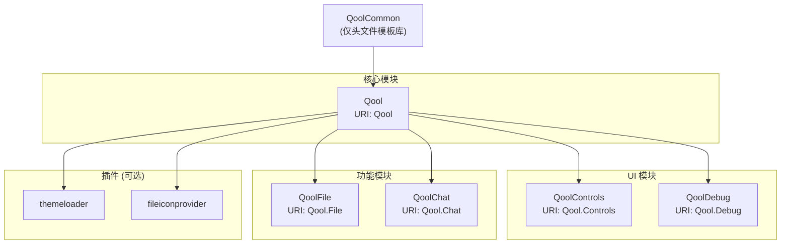

# QoolUI

基于 Qt6/QML 的现代化 UI 组件库。

## 技术栈

| 项目 | 版本/规范 |
|------|----------|
| Qt | 6.8+ |
| C++ | C++17 |
| CMake | 3.30+ |
| 命名空间 | `qoolui` (宏: `QOOL_NS`) |
| 版本 | 4.0.0 |

## 模块架构



## QML 模块 URI 映射

| 模块 | URI | 导入示例 |
|------|-----|---------|
| Qool | `Qool` | `import Qool` |
| QoolControls | `Qool.Controls` | `import Qool.Controls` |
| QoolFile | `Qool.File` | `import Qool.File` |
| QoolChat | `Qool.Chat` | `import Qool.Chat` |
| QoolDebug | `Qool.Debug` | `import Qool.Debug` |

## 构建命令

```bash
# 配置 (推荐 Ninja)
cmake -B build -G Ninja -DCMAKE_BUILD_TYPE=Release

# 构建
cmake --build build

# 安装 (输出到 build/install)
cmake --install build
```

## 编码规范

### 文件命名
- C++ 头文件: `qool_类名.h` / `qool_类名.hpp`，源文件: `qool_类名.cpp`
- QML 文件: 大驼峰 `ComponentName.qml`；私有组件放 `_private/` 目录
- 附属类与主类同文件（如 `NumberMapperStop` + `NumberMapper`）

### 命名空间
所有 C++ 文件内容用宏包裹，**禁止手写 `namespace qoolui {`**：
```cpp
QOOL_NS_BEGIN
// ... 类定义
QOOL_NS_END
```
`QOOL_NS` 由 CMake 从 `includes/qoolns.hpp.config` 生成（值 = `qoolui`）。

### 属性宏体系（QoolCommon）
**禁止手写 Q_PROPERTY + getter/setter 样板**。按场景选宏族（定义见 `QoolCommon/qoolcommon/`）：

| 宏族 | 适用 | 生成内容 |
|---|---|---|
| `QOBJECT_WRITABLE/READONLY/CONSTANT_PROPERTY` | QObject 类 | 一条宏 = 信号 + getter + setter + 成员 + Q_PROPERTY |
| `QBINDABLE_*_PROPERTY(_C_, _T_, _N_)` | Qt6 bindable 属性 | 额外生成 `bindable_xxx()` |
| `QGADGET_*_PROPERTY` | Q_GADGET 值类型（无 NOTIFY） | getter + setter + 成员 + Q_PROPERTY |

- 大文件声明/定义分离：头文件用 `_DECLARE` 后缀版（仅声明），实现在 .cpp 用同宏展开
- 宏固定命名：成员 `m_xxx`、setter 参数 `new_xxx`、getter 无前缀 `xxx()`、bindable `bindable_xxx()`
- QObject 可写 setter 自动带相等守卫 + emit；宏展开到 protected 作用域（便于子类访问）
- setter 参数类型自动选择：指针传值、其余传 `const T&`
- 例外（手写 Q_PROPERTY 而非宏）：多属性共享同一信号（如 `Message::channels`/`channel` 共用 `channelsChanged`）、无成员属性、非宏体系类（如 `Theme`）
- 批量属性变更用 `Qt::beginPropertyUpdateGroup()` / `endPropertyUpdateGroup()` 包裹，使多次 emit 原子化

### 批量属性生成
同型属性清单（如 20 个 QColor）用 `QOOL_FOREACH_N` 宏 + 属性名列表批量生成（`QoolCommon/qoolcommon/macro_foreach.hpp`）：
```cpp
#define __HANDLE__(N) QOBJECT_WRITABLE_PROPERTY_DECLARE(QColor, N)
QOOL_FOREACH_10(__HANDLE__, white, silver, grey, black, ...)
#undef __HANDLE__
```
- 仅用于**同型批量属性**，单个属性直接写宏
- 可在宏族之上组合领域专属宏（如 `QOOL_DECL_POINT`/`QOOL_IMPL_POINT`：一点三属性 + bindable + 组内原子更新）
- 同一属性清单在多个类间复用保持同步（`Style` / `StyleGroupAgent` 各持一份，.cpp 用相同 FOREACH 结构生成 emit）
- 局部宏命名约定：`__HANDLE__` / `DECL` / `__SET__`，用完 `#undef`

### 方法命名分层
| 层 | 命名 | 示例 |
|---|---|---|
| QML 暴露 API（Q_INVOKABLE、属性） | camelCase | `valueAt`、`dumpInfo` |
| 内部辅助方法 | snake_case | `get_value`、`initialize_data`、`propagate_theme` |
| 槽函数 | `when_` 前缀 | `when_themeChanged` |
| QQmlListProperty 回调 / 私有辅助 | `__` 双下划线前缀 | `__appendFunction`、`__auto_insert` |

### 单例
统一用 `QoolCommon/qoolcommon/singleton.hpp` 三件套，**禁止手写静态实例**：
- 头文件: `QOOL_SIMPLE_SINGLETON_DECL(类名)`
- 源文件: `QOOL_SIMPLE_SINGLETON_QT_IMPL(类名)`（线程安全）
- 需暴露给 QML 时追加 `QOOL_SIMPLE_SINGLETON_QML_CREATE(类名)` + `QML_SINGLETON`

### 值类型（QML 可见）
内部 `struct XxxData : QSharedData` 持数据 + 门面类暴露 API：`Q_GADGET` + `QML_VALUE_TYPE(小写名)`，按可构造性选 `QML_CONSTRUCTIBLE_VALUE`（Q_INVOKABLE 构造函数）或 `QML_STRUCTURED_VALUE`。链式 API 返回 `Type&`（如 `Message::attach()`）。

### QML 逻辑对象基类
QML 列表/逻辑容器继承 `SmartObject`（`Qool/utils/qool_smartobj.h`：QQmlParserStatus + DefaultProperty(smartItems)）。需要列表属性时：`Q_CLASSINFO("DefaultProperty", ...)` + `QML_LIST_PROPERTY_ASSIGN_BEHAVIOR_REPLACE_IF_NOT_DEFAULT` + `QQmlListProperty` + `__` 静态回调。

### 调试输出
统一用 `QoolCommon/qoolcommon/debug.hpp` 宏（带类名 token 与颜色），**禁止裸 qDebug()**：
- `xDebugQ` / `xInfoQ` / `xWarningQ` / `xCriticalQ` / `xFatalQ`（带 `[类名]` token）
- 颜色 token `xDBGYellow` 等；容器输出 `xDBGVariant` / `xDBGList` / `xDBGMap` / `xDBGQPropertyList`

### 信号命名
- 属性变更: `xxxChanged`（宏生成）
- 动作/请求: 语义短语 `wannaXxx`（如 `wannaSignIn`、`wannaDumpInfo`）
- 注意 `messageRecieved` 的拼写是**既有 API，勿修正**（多处一致）

### QML 组件规范
- import 惯例: `import QtQuick`（无版本号）、`import QtQuick.Templates as T`、`import Qool`、`import "_private"`；必要时 `pragma ComponentBehavior: Bound`
- 根组件选择: 交互控件用 `T.*` 模板基类（T.Control / T.AbstractButton / T.ComboBox ...）；纯装饰用 Item/Text；调试叠加层用 Floater；逻辑容器用 SmartObject
- 统一 `id: root`；固定内部命名: 背景 `bgbox`、padding `spacer`（SpaceHelper）、逻辑对象 `pCtrl`、页面主列 `cc`
- 样式一律取自 `root.Style.*`（附加属性）；背景封装为 `QoolBoxSettings` 对象（属性名 `backgroundSettings`，就地覆写 `borderWidth`/`fillColor`/`cutSize*`）
- 动画用 `Basic*Behavior on X`（BasicNumber/Color/TextBehavior）+ `enabled: root.Style.animationEnabled` 门控
- 交互反馈: `ControlPressedCover` / `ControlHighlightCover` / `ControlLockedCover` 三件套
- delegate 用 `required property` 接收 model/index；对外状态用 `readonly property` 代理内部 pCtrl
- 文案一律 `qsTr()`；页面派生 `BasicPage`（required title/note），`SectionBar` 分段，`QoolTip` 内嵌
- 块尾注释标记闭合: `}//contentItem`

### QML 模块注册 (CMake)
```cmake
qt_add_qml_module(ModuleName
    URI Qool.Module      # QML 导入 URI
    VERSION ${QOOLUI_VERSION_QML}
    NAMESPACE ${QOOL_NS} # 固定为 qoolui
    IMPORTS Qool         # 子模块必须声明依赖核心模块
    QML_FILES ...
    SOURCES ...
)
```
- QML 单例文件用 CMake 属性注册（而非 QML_SINGLETON 注解）: `set_source_files_properties(Xxx.qml PROPERTIES QT_QML_SINGLETON_TYPE TRUE)`
- 文件按目录分组列出（如 `apps/xxx.h`），include 目录对应声明

## 文档规范（QDoc）

- QDoc 注释仅从 `.cpp`/`.qdoc` 文件提取，**头文件不被 QDoc 扫描**——发布头（`qoolns.hpp`、`interfaces/*.h`）禁止 QDoc 注释，只允许普通注释（`//`、`/* */`）
- C++ QML 类型：类文档（`\qmltype` + `\nativetype`）写在对应 `.cpp`；宏生成属性无代码位置可挂 → 用独立 `\qmlproperty` 注释块，集中到 `Qool/qool.qdoc`
- `.qml` 类型：`\qmltype` 注释块紧贴 `.qml` 文件内类型上方
- 模块总览（`\qmlmodule`）与组织性文章（`\page`）必须独立 `.qdoc` 文件，放模块根目录（如 `Qool/qool.qdoc`）
- `.qdoc` 是代码的 sidecar：对应某个代码文件的 `.qdoc` 放在该文件旁边、尽量同名（如 `qool_style.cpp` → `qool_style.qdoc`）
- 一律不设 `doc/` 目录
- 刻意设计（非 bug 行为、设计意图）必须用 QDoc 说明，防止后续审查误判（先例：fillItem 替代 CutCornerImage、关闭按钮配件哲学、control 回退值机制）

## 变更记录

- 每次修改更新 `CHANGELOG.md`（已加入 `QOOL_GENERAL` 目标）
- 版本号不随常规修改迭代，维持 `4.0.0` 直至正式发布时递增

## 核心库瘦身原则

- 只保留通用/轻量/自洽/Qt 生态内能力；特化、有宿主归属、可被 Qt 原生替代的一律外移（V3 对比裁定先例：持久化交宿主、CutCornerImage→Qt 6.8 `ShapePath::fillItem`、图片加载→`QQuickImageProvider`）

## 已知陷阱

### 1. QML 模块依赖顺序
子模块必须在 `qt_add_qml_module` 中声明 `IMPORTS Qool`，否则运行时找不到基类组件。

### 2. 插件加载路径
`qoolplugins/` 目录必须与可执行文件同级目录:
```
build/
├── QoolUIExample.exe
├── qml/
└── qoolplugins/  ← 必须在此位置
```

### 3. CMake 缓存问题
修改 QML 模块结构后需清理缓存:
```bash
rm -rf build/CMakeCache.txt build/CMakeFiles
```

### 4. 私有 QML 文件
`_private/*.qml` 需设置 `QT_QML_INTERNAL_TYPE TRUE`，不对外暴露。

## 关键文件路径

| 用途 | 路径 |
|------|------|
| 项目配置 | [qool_qml_project_setup.cmake](file:///e:/workspace/QoolUI4/qool_qml_project_setup.cmake) |
| 命名空间定义 | [includes/qoolns.hpp.config](file:///e:/workspace/QoolUI4/QoolUI/includes/qoolns.hpp.config) |
| 插件接口 | [interfaces/](file:///e:/workspace/QoolUI4/QoolUI/interfaces/) |
| 变更记录 | [CHANGELOG.md](file:///e:/workspace/QoolUI4/CHANGELOG.md) |
